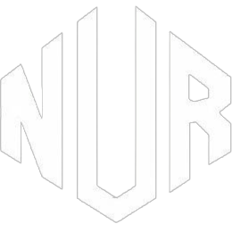

# Nur Islam - Portfolio Website

A modern, responsive personal portfolio website showcasing data analysis projects, research publications, and web development work.



## Features

### Core Functionality
- **Single-Page Application** - Smooth page transitions with GSAP animations
- **Responsive Design** - Optimized for mobile, tablet, and desktop devices
- **Dynamic Color Themes** - 6 customizable color schemes (Red, Purple, Blue, Green, Orange, Teal)
- **Interactive Particle Background** - Animated particle system on homepage
- **Contact Form** - Integrated with EmailJS for serverless email functionality
- **Lazy Loading** - Optimized image loading for better performance

### Sections
1. **Home** - Hero section with animated particle background and typing effect
2. **About** - Personal introduction with downloadable CV
3. **Services/Expertise** - Three core competency cards (Data Analytics, AI Research, Academic Leadership)
4. **Skills** - Animated progress bars for technical skills
5. **Portfolio** - Featured projects with GitHub links
6. **Research** - Published and ongoing research papers
7. **Contact** - Contact form with info panel

## Technologies Used

### Frontend
- **HTML5** - Semantic markup
- **CSS3** - Custom styling with animations
- **JavaScript (ES6)** - Modern vanilla JavaScript

### Libraries & Frameworks
- **GSAP v3.2.6** - Animation library for page transitions
- **Particles.js** - Interactive particle background
- **jQuery** - DOM manipulation (to be replaced with vanilla JS)
- **EmailJS v3** - Serverless email service for contact form

### Fonts
- **Raleway** (300 weight)
- **Monoton**
- **Poppins** (500 weight)

## Project Structure

```
Portfolio/
├── index.html              # Main HTML file
├── css/
│   ├── index.css          # Main stylesheet
│   ├── color-*.css        # Theme variations (6 colors)
│   └── breaker-style-*.css # Page transition styles
├── js/
│   ├── index.js           # Main JavaScript
│   ├── config.js          # EmailJS configuration
│   ├── contact.js         # Contact form handler
│   ├── jquery.min.js      # jQuery library
│   └── particles.min.js   # Particles library
├── images/                # Image assets
├── CV/
│   └── MY_CV.pdf         # Resume/CV file
├── README.md             # This file
├── SECURITY.md           # Security configuration guide
└── .gitignore            # Git ignore rules
```

## Setup & Installation

### Prerequisites
- A modern web browser (Chrome, Firefox, Safari, Edge)
- A code editor (VS Code, Sublime Text, etc.) - optional
- Git - for version control

### Local Development

1. **Clone the repository**
   ```bash
   git clone <your-repo-url>
   cd Portfolio
   ```

2. **Open in browser**
   Simply open `index.html` in your web browser:
   ```bash
   # macOS
   open index.html

   # Linux
   xdg-open index.html

   # Windows
   start index.html
   ```

3. **Or use a local server** (recommended)
   ```bash
   # Python 3
   python -m http.server 8000

   # Python 2
   python -m SimpleHTTPServer 8000

   # Node.js (if you have npx)
   npx serve
   ```
   Then navigate to `http://localhost:8000`

### Configuration

#### EmailJS Setup

1. **Sign up** at [EmailJS](https://www.emailjs.com/)

2. **Create an email service**
   - Go to Email Services
   - Add a new service (Gmail, Outlook, etc.)

3. **Create an email template**
   - Go to Email Templates
   - Create a template with these variables:
     - `{{name}}`
     - `{{email}}`
     - `{{subject}}`
     - `{{message}}`

4. **Update configuration**
   Edit `js/config.js` with your credentials:
   ```javascript
   const EMAILJS_CONFIG = {
       publicKey: "YOUR_PUBLIC_KEY",
       serviceId: "YOUR_SERVICE_ID",
       templateId: "YOUR_TEMPLATE_ID"
   };
   ```

5. **Configure domain restrictions**
   - Go to your EmailJS dashboard → Security
   - Add your domain to the allowlist
   - See `SECURITY.md` for details

#### Customization

**Update Personal Information:**
- Edit contact details in `index.html` (lines ~660-690)
- Replace `images/about100.jpg` with your photo
- Update CV at `CV/MY_CV.pdf`
- Modify social media links (lines ~128-130)

**Change Color Theme:**
Users can select themes via the gear icon, but to change the default:
- Edit the `<link>` tag in `index.html` to load a different color CSS

**Modify Skills:**
- Edit skill names and percentages in `index.html` (lines ~285-345)
- Adjust CSS in `.prog` class for animation

**Update Projects:**
- Edit portfolio items in `index.html` (lines ~390-455)
- Replace project images in `images/` folder
- Update GitHub links

## Deployment

### GitHub Pages

1. **Push to GitHub**
   ```bash
   git add .
   git commit -m "Initial commit"
   git branch -M main
   git remote add origin <your-repo-url>
   git push -u origin main
   ```

2. **Enable GitHub Pages**
   - Go to repository Settings
   - Navigate to Pages section
   - Select source: `main` branch, `/ (root)`
   - Save

3. **Access your site**
   - URL will be: `https://yourusername.github.io/repository-name/`

### Netlify

1. **Sign up** at [Netlify](https://www.netlify.com/)
2. **Drag and drop** your Portfolio folder
3. **Configure**
   - Build command: (leave empty)
   - Publish directory: (leave empty or use `.`)

### Vercel

1. **Sign up** at [Vercel](https://vercel.com/)
2. **Import Git repository**
3. **Deploy** - Vercel auto-detects static site
4. **Update URLs** in `index.html` meta tags with your deployment URL

## Performance Optimization

### Current Optimizations
- ✅ Lazy loading for images
- ✅ Minified JavaScript libraries
- ✅ Removed duplicate files
- ✅ SEO meta tags

### Recommended Improvements
- **Image Optimization**
  - Compress images using [TinyPNG](https://tinypng.com/)
  - Convert to WebP format
  - Target: Reduce total image size from ~25MB to ~5MB

- **Code Minification**
  - Minify `css/index.css`
  - Minify `js/index.js`

- **Build System**
  - Set up Vite or Parcel for bundling
  - Enable tree-shaking for unused code

- **Caching**
  - Add service worker for offline support
  - Implement browser caching headers

## Browser Support

- ✅ Chrome (latest)
- ✅ Firefox (latest)
- ✅ Safari (latest)
- ✅ Edge (latest)
- ⚠️ IE11 (not fully tested)

## Accessibility

Current features:
- Semantic HTML structure
- Alt text for all images
- Keyboard navigation support
- Color contrast (WCAG AA compliant on default theme)

Planned improvements:
- ARIA labels for interactive elements
- Screen reader optimization
- Focus indicators for keyboard navigation

## Known Issues

1. **Custom Cursor** - May interfere with accessibility tools
2. **Fixed Viewport Heights** - May cause issues on very small screens
3. **jQuery Dependency** - Planned to be replaced with vanilla JS

## Future Enhancements

- [ ] Convert to Progressive Web App (PWA)
- [ ] Add dark/light mode toggle
- [ ] Implement blog with actual posts
- [ ] Add project filtering by technology
- [ ] Create detailed project case studies
- [ ] Add testimonials section
- [ ] Integrate Google Analytics
- [ ] Replace jQuery with vanilla JavaScript
- [ ] Split CSS into modular files
- [ ] Add unit tests

## Contributing

This is a personal portfolio, but suggestions are welcome!

1. Fork the repository
2. Create a feature branch (`git checkout -b feature/improvement`)
3. Commit your changes (`git commit -m 'Add improvement'`)
4. Push to the branch (`git push origin feature/improvement`)
5. Open a Pull Request

## License

This project is open source and available for personal use. If you use this template, please give credit and customize it with your own content.

## Contact

- **Email**: nurislamshourav6@gmail.com
- **Phone**: +8801533513104
- **Location**: Dhaka, Bangladesh
- **GitHub**: [Your GitHub Profile]
- **LinkedIn**: [Your LinkedIn Profile]

## Acknowledgments

- Original template inspired by "Willy Wonka Theme" by Sujal
- GSAP for animation capabilities
- EmailJS for email service
- Particles.js for particle effects

---

**Last Updated**: December 2025

**Version**: 2.0 (Optimized)
